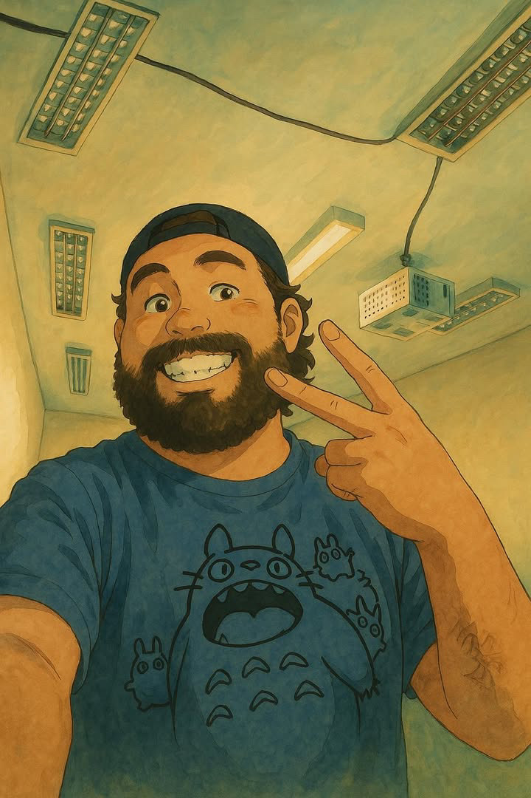

# Olá! Eu sou o Paulo

<!-- ```php
require_once "PauloSantos.php";

class SobreMim extends Desenvolvedor {
  public $nome = "Paulo H. Santos";
  public $area = "Docente / Dev. Fullstack";
  public $contato = [
      "paulo.whsantos@hotmail.com",
      "linkedin.com/in/paulowh/",
      "instagram.com/paulo.wh",
      "paulowh.github.io"
    ];
  public $trabalho = "Senac";
  public $local = "Americana/SP";
}

class Skills extends Desenvolvedor {
  public $linguagens = [
      "C#",
      "java",
      "javaScript",
      "php",
      "python"
    ];
  public $bibliotecas = ["JQuery"];
  public $frameworks = [
      "bootstrap",
      "Laravel",
      "ReactJS",
      "Semantic UI",
      "Spring Boot"
    ];
}
``` -->



<p align="left">
    <blockquote>
        &nbsp;&nbsp;&nbsp;🖐🏼 Olá, eu me chamo <strong>Paulo Santos</strong>! Sou <strong>docente de Programação</strong> no <strong>Senac Americana</strong> e também atuo como <strong>programador</strong>. Tenho uma paixão enorme por tecnologia e ensino gosto de transformar códigos em conhecimento e desafios em diversão! 💡💻
    </blockquote>
</p>

<p align="left">
    <blockquote>
        &nbsp;&nbsp;&nbsp;🚀 Estou sempre explorando novas linguagens, frameworks e ferramentas para manter meu repertório afiado. Curto compartilhar experiências com a comunidade tech, aprender com os outros e ficar por dentro das tendências que estão moldando o futuro da programação. 📚🧠
    </blockquote>
</p>

<br>
<div align="center">
  <a href="https://github.com/paulowh"></a>
  
  
</div>

<br>
<div align="center" style="display: inline_block">
  
  
  
  
  
  
  
  
  
  
  
  
  
  
  
    
</div>

<!-- <picture align="center">
  <source media="(prefers-color-scheme: dark)" srcset="https://raw.githubusercontent.com/paulowh/paulowh/output/github-contribution-grid-snake-dark.svg">
  <source media="(prefers-color-scheme: light)" srcset="https://raw.githubusercontent.com/paulowh/paulowh/output/github-contribution-grid-snake.svg">
  
</picture> -->

## Compartilhando o conhecimento: [wiki](https://github.com/paulowh/paulowh/wiki)
